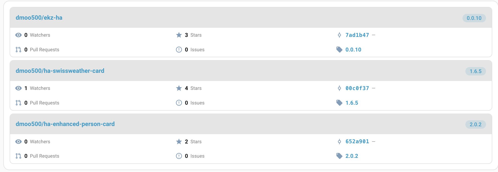
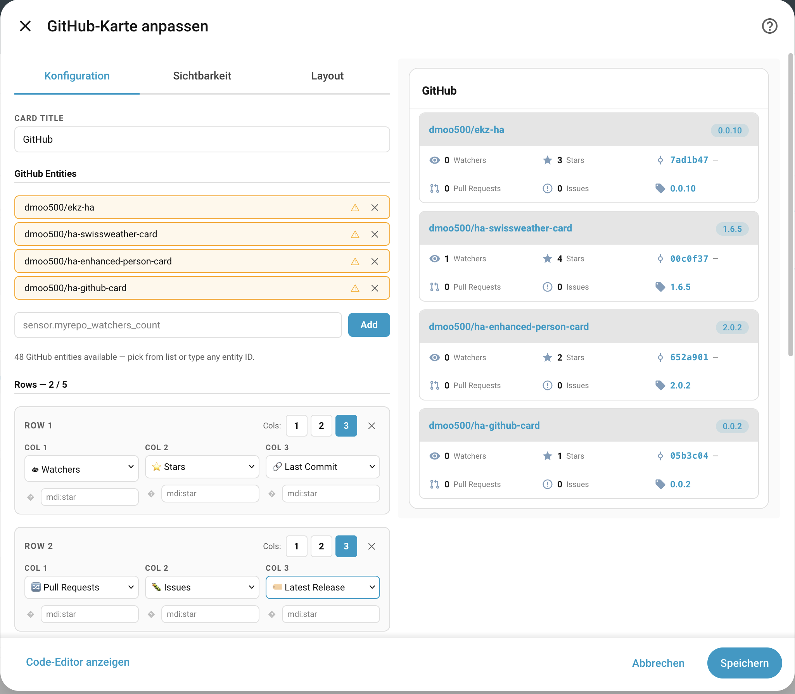
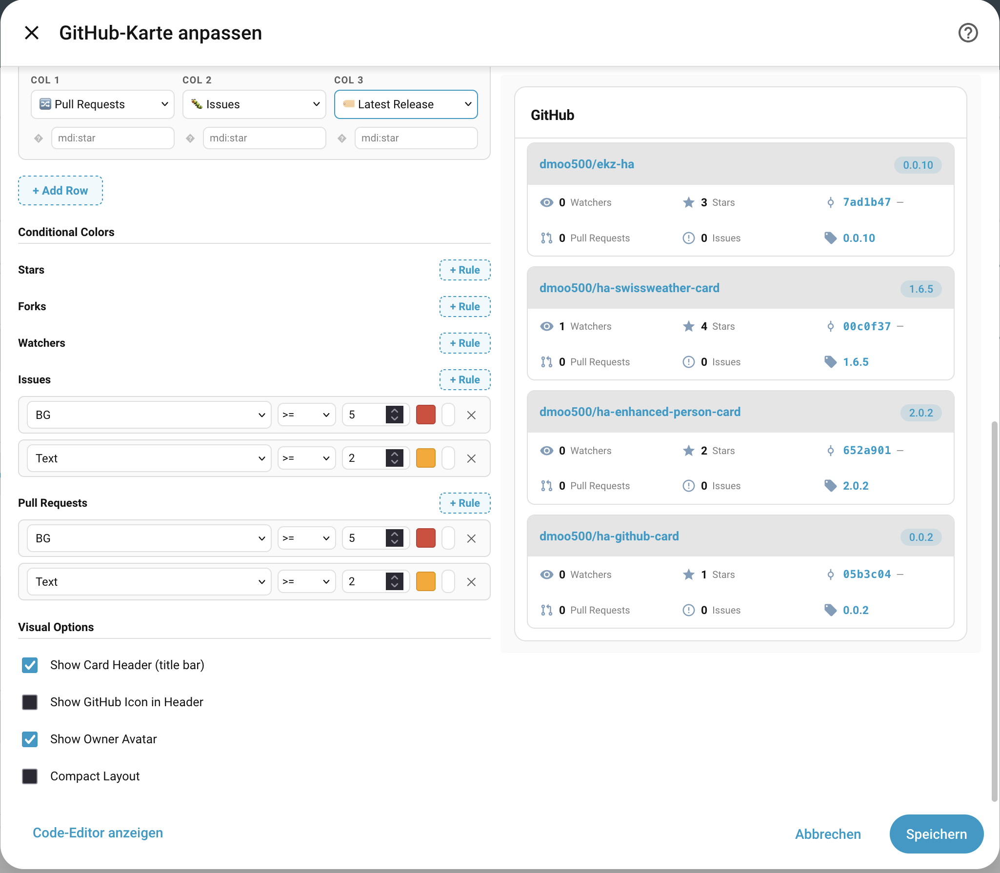

# ha-github-card

A custom [Home Assistant](https://www.home-assistant.io/) Lovelace card that displays information from your GitHub repositories tracked via the official [GitHub integration](https://www.home-assistant.io/integrations/github/).



## Features

- Table-like layout per repository: owner avatar, repo name, latest release tag
- Fully configurable stat rows — up to 5 rows with 1–3 columns each
- Available stats: Stars, Forks, Watchers, Issues, Pull Requests, Last Commit, Latest Release
- **Conditional color rules** per stat column — color text or background based on threshold
- Visual card editor with entity picker, row/column configurator and color rule builder
- Owner avatar auto-derived from repository name
- Compact layout option
- Fully themed via HA CSS variables

## Requirements

1. [GitHub integration](https://www.home-assistant.io/integrations/github/) installed and configured in Home Assistant
2. At least one repository added to the GitHub integration

## Installation

### HACS (recommended)

1. Open HACS → Frontend → "+ Explore & download repositories"
2. Search for **ha-github-card** and install
3. Add the resource if needed: `/hacsfiles/ha-github-card/ha-github-card.js`

### Manual

1. Download `ha-github-card.js` from the [latest release](https://github.com/dmoo500/ha-github-card/releases)
2. Copy it to `config/www/ha-github-card/ha-github-card.js`
3. Add the resource in Settings → Dashboards → Resources: `/local/ha-github-card/ha-github-card.js`

## Configuration

### Via Visual Editor

Click the edit button on a dashboard, add a new card, search for **GitHub Card**.



Use the entity input to select any sensor from a GitHub repository device (e.g. `sensor.myrepo_watchers_count`). The card automatically aggregates all sensors from the same device.

Configure rows and columns freely — each row can have 1, 2 or 3 stat slots.

#### Conditional Colors



Add color rules per stat slot. Each rule has:
- **Text / BG** — apply the color to the value text or the cell background
- **Operator** — `>`, `>=`, `<`, `<=`, `==`
- **Threshold** — the numeric value to compare against
- **Color** — any CSS color string

The first matching rule wins.

### YAML

```yaml
type: custom:ha-github-card
title: GitHub
entities:
  - sensor.myrepo_watchers_count   # any sensor from the GitHub device works
show_avatar: true
show_header: true
show_header_icon: true
compact: false
rows:
  - [watchers, stars, last_commit]
  - [pull_requests, issues]
```

### All Options

| Option              | Type      | Default | Description                                                      |
|---------------------|-----------|---------|------------------------------------------------------------------|
| `title`             | `string`  | —       | Card header title                                                |
| `entities`          | `list`    | `[]`    | One entity ID per GitHub repository (any sensor from the device) |
| `show_avatar`       | `boolean` | `true`  | Show repository owner avatar                                     |
| `show_header`       | `boolean` | `true`  | Show the card header bar                                         |
| `show_header_icon`  | `boolean` | `true`  | Show the GitHub icon in the card header                          |
| `compact`           | `boolean` | `false` | Compact layout with reduced padding                              |
| `rows`              | `list`    | see below | List of rows, each a list of 1–3 slot keys                    |
| `icons`             | `map`     | —       | Per-slot icon override (e.g. `stars: mdi:star-outline`)          |
| `slot_colors`       | `map`     | —       | Per-slot conditional color rules (see below)                     |

**Default rows:**
```yaml
rows:
  - [watchers, stars, last_commit]
  - [pull_requests, issues]
```

### Available Slot Keys

| Key             | Description                    |
|-----------------|-------------------------------|
| `stars`         | Stargazer count               |
| `forks`         | Fork count                    |
| `watchers`      | Watcher count                 |
| `issues`        | Open issue count              |
| `pull_requests` | Open pull request count       |
| `last_commit`   | Latest commit SHA + date      |
| `last_release`  | Latest release tag            |
| `none`          | Empty slot (hidden)           |

### Conditional Color Rules

Color rules can be defined per numeric slot. The first matching rule applies.

```yaml
slot_colors:
  stars:
    - op: ">="
      value: 100
      color: "var(--success-color, #4caf50)"
      type: background
    - op: ">="
      value: 10
      color: "var(--warning-color, #ff9800)"
      type: text
  issues:
    - op: ">="
      value: 20
      color: "var(--error-color, #f44336)"
      type: background
    - op: ">="
      value: 1
      color: "var(--warning-color, #ff9800)"
      type: text
```

**Rule fields:**

| Field   | Type     | Description                                              |
|---------|----------|----------------------------------------------------------|
| `op`    | `string` | Operator: `>`, `>=`, `<`, `<=`, `==`                    |
| `value` | `number` | Threshold to compare against                             |
| `color` | `string` | CSS color — hex, named, or HA variable                   |
| `type`  | `string` | `text` (default) or `background`                         |

Supported slots for color rules: `stars`, `forks`, `watchers`, `issues`, `pull_requests`

## Development

```bash
yarn install
yarn build      # production build
yarn type-check # TypeScript check
yarn lint       # ESLint
```

## License

MIT
